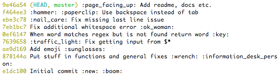
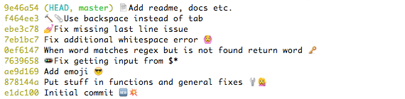

emojify
=======
Emoji on the command line :scream:
----------------------------------

THIS IS A VERY USEFUL SCRIPT. IT WILL ABSOLUTELY BOOST YOUR PRODUCTIVITY AND
HELP YOU IN YOUR DAILY WORK.

:wink:

Basically, emojify substitutes emoji aliases that many services
(like [GitHub](https://github.com/)) use for emoji raw characters.


Installation
------------

[emojify](emojify) is a shell script, so put it somewhere and make sure it's
added to your `$PATH`.

Here's a one-liner:
```sh
$ sudo sh -c "curl https://raw.githubusercontent.com/mrowa44/emojify/master/emojify -o /usr/local/bin/emojify && chmod +x /usr/local/bin/emojify"
```


Usage
-----

Here's a clever example:
```sh
$ emojify "Hey, I just :raising_hand: you, and this is :scream: , but here's my :calling: , so :telephone_receiver: me, maybe?"
```
would output:
> Hey, I just :raising_hand: you, and this is :scream: , but here's my
> :calling: , so :telephone_receiver: me, maybe?


Or maybe:
```sh
$ emojify "To :bee: , or not to :bee: : that is the question... To take :muscle: against a :ocean: of troubles, and by opposing, end them?"
```
> To :bee: , or not to :bee: : that is the question... To take :muscle: against
> a :ocean: of troubles, and by opposing, end them?

Or you could run it through git log with something like:
```sh
$ git log --oneline --color | emojify | less
```
and go from this dull thing:



to this:



To have an alias that does that for you, add something like:
```
log = ! git log --oneline --color | emojify | less
```
to your `.gitconfig`.

Note: if you want colors you need to specify the `--color` option.

To invoke help run `emojify -h`.

License
-------
MIT
